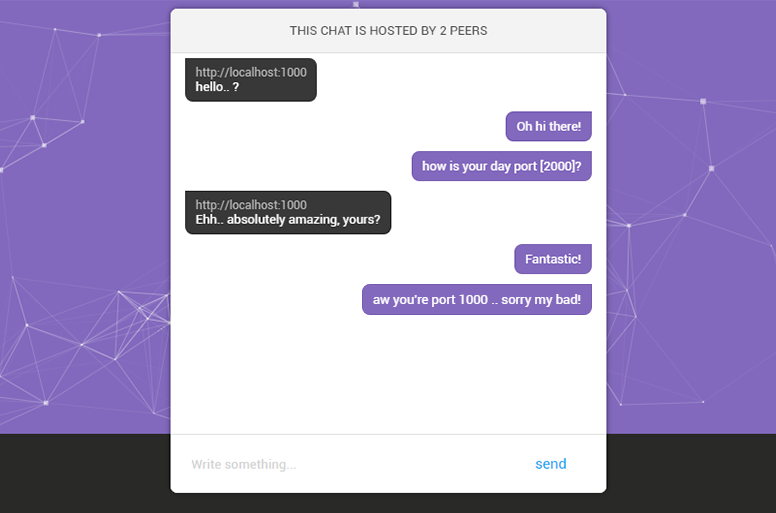

<p align="center"></p>

# Vesta

A simple ruby decentralized p2p messenger with E2EE __(end-to-end-encryption, that means nobody can read your messages without your private-key so then keep it secret!, for more information about how does rsa or public-key encryption works click <a href="https://en.wikipedia.org/wiki/RSA_(cryptosystem)">here</a>)__

it need more improvements, but it does the job.

[](https://github.com/eVanilla/Vesta)

## Screenshot

<p align="center"></p>

## Installation

first of all you'll need to install ```ruby``` if you didn't installed it.. you can search it on google.

Clone the repo by:
```
$ git clone https://github.com/eVanilla/Vesta
```
and then navigate to the ```vesta``` folder and install the gems by:
```
$ bundle install
```
if that didn't work.. install them manualy

## Usage

it's not too complicated.

Running a node:
```
$ ruby vesta.rb '[your_ip]' [your_port]
# eg.
$ ruby vesta.rb 'http://localhost' 1000
# and you're ready to open this (http://localhost:1000) page on browser.  
``` 
Connecting to a node:
```
$ ruby vesta.rb '[your_ip]' [your_port] '[peer_ip]' [peer_port]
# eg.
$ ruby vesta.rb 'http://localhost' 1000 'http://localhost' 2000
# and you're ready to open this (http://localhost:1000) page on browser.  
```

### Improvements that can be made
* Secure private chats
* Better ui
* Better code style
* &...

**Also if you liked it.. you can hit that star button to make me happy!**